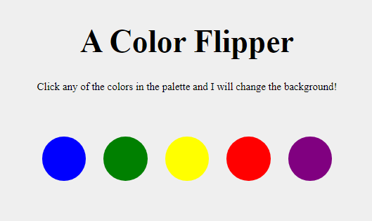
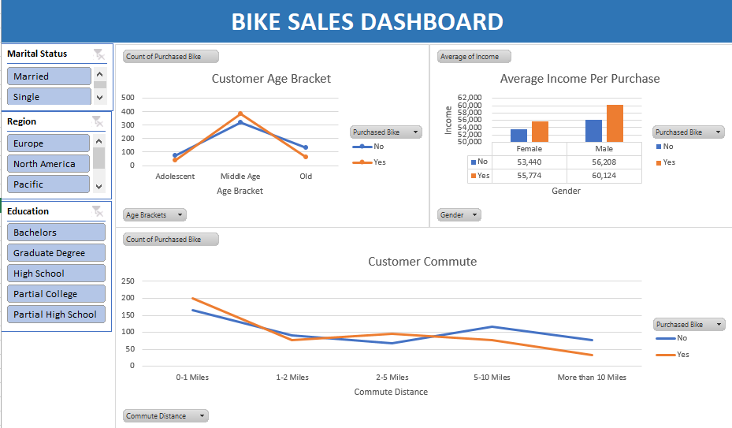

  

<h1 align="center">Adams Shittu</h1>

My most recent projects are placed at the top. <em>Check out my <strong><a href="#frontend">frontend wed development Projects</a></strong> and <strong><a href="#analytics">data analysis projects</a></strong></em>. 

<h2 align="center"> Backend Web Development Projects </h2>
<ol>

  <li>
    <h3>Blog Project</h3>
    
Technologies Used: <strong>Python, Django, HTML, CSS, Bootstrap, SQlite</strong>

    

      Check out the  
      <strong><a target="_blank" href="https://github.com/shittuadams/my-first-blog">code</a></strong> 
       and the 
      <strong><a target="_blank" href="https://shittu.pythonanywhere.com/">live demo</a></strong>
       of the project.
    

    

        
    

  </li>
  
</ol>

<h2 id="frontend" align="center"> Frontend Web Development Projects </h2>

<ol>

  <li>
    <h3>Simple Calculator Project</h3>

    
Technologies Used: <strong>HTML, CSS, JavaScript</strong>

    

      Check out the  
      <strong><a target="_blank" href="https://codepen.io/Shadams/pen/NWLBjGP">code</a></strong> 
       and the 
      <strong><a target="_blank" href="https://codepen.io/Shadams/full/NWLBjGP">live demo</a></strong> 
       of the project.
    

    

      
    

  </li>

  <li>
    <h3>Colour Flipper Project</h3>
    
For more details on this project click <a target="_blank" href="https://codepen.io/Shadams/pen/eYLyEXx">here</a>.

    

        
    

  </li>

  <li>
    <h3>Markdown Previewer Project</h3>
    
For more details on this project click <a target="_blank" href="https://codepen.io/Shadams/pen/pozwbwg">here</a>.

    

        
    

  </li>

  <li>
    <h3>Drum Machine Project</h3>
    
For more details on this project click <a target="_blank" href="https://codepen.io/Shadams/pen/BaBmzxV">here</a>.

    

       
    

  </li>

  <li>
    <h3>Random Quote Machine Project</h3>
    
For more details on this project click <a target="_blank" href="https://codepen.io/Shadams/pen/bGbezxq">here</a>.

    

       
    

  </li>

  <li>
    <h3>Armstrong of Three Digit Checker Project</h3>
    
For more details on this project click <a target="_blank" href="https://codepen.io/Shadams/pen/OwKzOJ">here</a>.

    

        
    

  </li>

  <li>
    <h3>Technical Documentation Page Project</h3>
    
For more details on this project click <a target="_blank" href="https://codepen.io/Shadams/pen/gKmJpp">here</a>.

    

       
    

  </li>

</ol>

<h2 id="analytics" align="center">Data Analysis Projects</h2>

<ol>

  <li>
    <h3>Airbnb Project</h3>
    
For more details on this project click <a target="_blank" href="https://github.com/shittuadams/AirBnB-Project">here</a>.

    

       
    

  </li>
  

  
  <li>
    <h3>Global Superstore Perfomance Dashboard Using Tableau</h3>
    
For more details on this project click <a target="_blank" href="https://github.com/shittuadams/globalPerformance">here</a>.

    

        
    

  </li>
  

  
  <li>
    <h3>Dashboard of Covid-19 Dataset Using Tableau</h3>
    
For more details on this project click <a target="_blank" href="https://github.com/shittuadams/Covid-19-Dashboard">here</a>.

    

        
    

  </li> 
  

  
  <li>
    <h3>Data Visualization of Wallmart's Retail Dataset Using Tableau</h3>
    
For more details on this project click <a target="_blank" href="https://github.com/shittuadams/WallmartDataAnalysis">here</a>.

    

        
    

  </li> 
  

  
  <li>
    <h3>Excel Data Analysis Project using the Bike Buyers Dataset</h3>
    
For more details on this project click <a target="_blank" href="https://github.com/shittuadams/excel-data-analysis-project-on-bike-buyers-dataset">here</a>.

    

        
    

  </li> 
  

  
</ol>

  <a href="#top" style="padding: 10px 20px; background-color: #007BFF; color: white; text-decoration: none; border-radius: 5px;">
    Go to Top
  </a>

