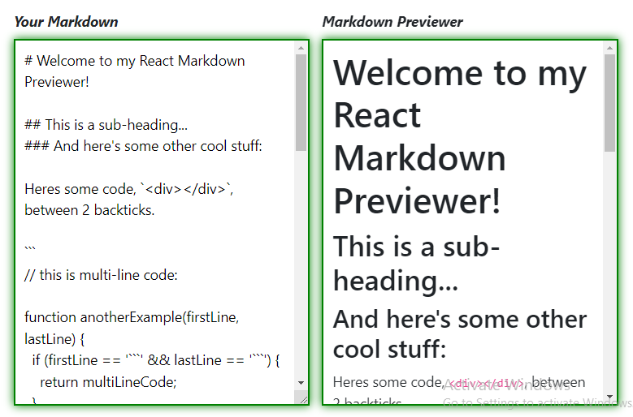
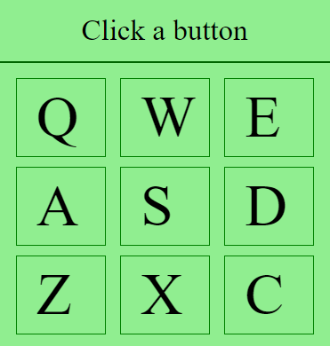
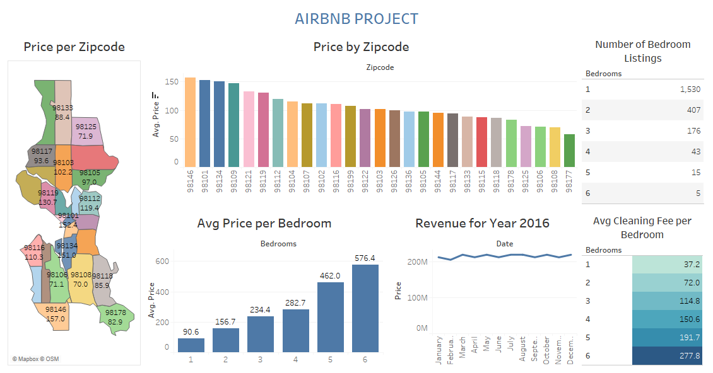
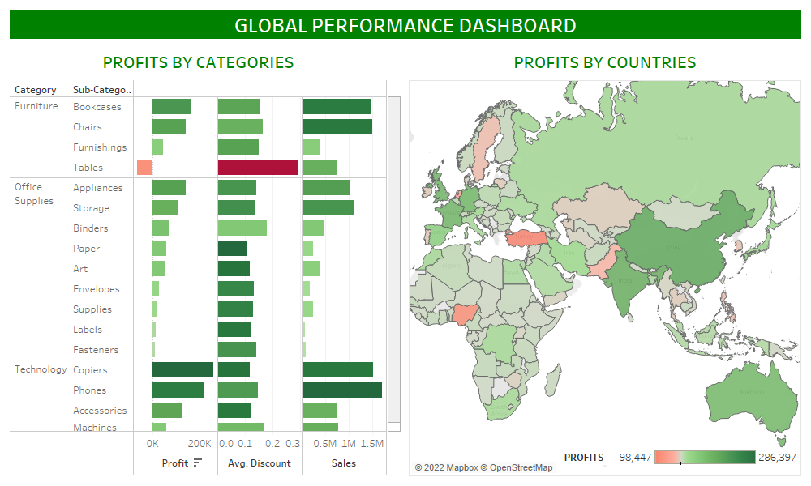

  

<h1 align="center" style="font-family: Arial, sans-serif; color: #007BFF;">I'm Adams Shittu</h1>

  An educator with a knack for simplifying seemingly complex topics.

  <em> 
    👉 <strong><a href="#frontend" style="color: #007BFF;">Frontend Web Development Projects</a></strong> 
     
    👉 <strong><a href="#analytics" style="color: #007BFF;">Data Analysis Projects</a></strong>.
  </em>

<h2 align="center" style="font-family: Arial, sans-serif; background-color: #f0f0f0; padding: 10px; border-radius: 5px; color: #007BFF;">
  Backend Web Development Projects
</h2>
<ol style="font-family: Arial, sans-serif; color: #333; line-height: 1.6;">

  <li style="padding: 20px; box-shadow: 5px 5px 15px rgba(0, 0, 0, 0.3);">
    <h3 style="color: #333;">Blog Project</h3>
    
Technologies Used: <strong>Python, Django, HTML, CSS, Bootstrap, SQLite</strong>

    

      Check out the  
      <strong><a target="_blank" href="https://github.com/shittuadams/my-first-blog" style="color: #007BFF; text-decoration: none;">code</a></strong> 
       and the 
      <strong><a target="_blank" href="https://shittu.pythonanywhere.com/" style="color: #007BFF; text-decoration: none;">live demo</a></strong>
       of the project.
    

    

      
    

  </li>
  
</ol>

<h2 id="frontend" align="center" style="font-family: Arial, sans-serif; background-color: #f0f0f0; padding: 10px; border-radius: 5px; color: #007BFF;">
  Frontend Web Development Projects
</h2>

<ol>

  <li>
    <h3>Simple Calculator Project</h3>

    
Technologies Used: <strong>HTML, CSS, JavaScript</strong>

    

      Check out the  
      <strong><a target="_blank" href="https://codepen.io/Shadams/pen/NWLBjGP">code</a></strong> 
       and the 
      <strong><a target="_blank" href="https://codepen.io/Shadams/full/NWLBjGP">live demo</a></strong> 
       of the project.
    

    

      
    

  </li>

  <li>
    <h3>Colour Flipper Project</h3>
    
For more details on this project click <a target="_blank" href="https://codepen.io/Shadams/pen/eYLyEXx">here</a>.

    

        
    

  </li>

  <li>
    <h3>Markdown Previewer Project</h3>
    
For more details on this project click <a target="_blank" href="https://codepen.io/Shadams/pen/pozwbwg">here</a>.

    

        
    

  </li>

  <li>
    <h3>Drum Machine Project</h3>
    
For more details on this project click <a target="_blank" href="https://codepen.io/Shadams/pen/BaBmzxV">here</a>.

    

       
    

  </li>

  <li>
    <h3>Random Quote Machine Project</h3>
    
For more details on this project click <a target="_blank" href="https://codepen.io/Shadams/pen/bGbezxq">here</a>.

    

       
    

  </li>

  <li>
    <h3>Armstrong of Three Digit Checker Project</h3>
    
For more details on this project click <a target="_blank" href="https://codepen.io/Shadams/pen/OwKzOJ">here</a>.

    

        
    

  </li>

  <li>
    <h3>Technical Documentation Page Project</h3>
    
For more details on this project click <a target="_blank" href="https://codepen.io/Shadams/pen/gKmJpp">here</a>.

    

       
    

  </li>

</ol>

<h2 id="analytics" align="center" style="font-family: Arial, sans-serif; background-color: #f0f0f0; padding: 10px; border-radius: 5px; color: #007BFF;">
  Data Analysis Projects
</h2>

<ol>

  <li>
    <h3>Airbnb Project</h3>
    
For more details on this project click <a target="_blank" href="https://github.com/shittuadams/AirBnB-Project">here</a>.

    

       
    

  </li>
  

  
  <li>
    <h3>Global Superstore Perfomance Dashboard Using Tableau</h3>
    
For more details on this project click <a target="_blank" href="https://github.com/shittuadams/globalPerformance">here</a>.

    

        
    

  </li>
  

  
  <li>
    <h3>Dashboard of Covid-19 Dataset Using Tableau</h3>
    
For more details on this project click <a target="_blank" href="https://github.com/shittuadams/Covid-19-Dashboard">here</a>.

    

        
    

  </li> 
  

  
  <li>
    <h3>Data Visualization of Wallmart's Retail Dataset Using Tableau</h3>
    
For more details on this project click <a target="_blank" href="https://github.com/shittuadams/WallmartDataAnalysis">here</a>.

    

        
    

  </li> 
  

  
  <li>
    <h3>Excel Data Analysis Project using the Bike Buyers Dataset</h3>
    
For more details on this project click <a target="_blank" href="https://github.com/shittuadams/excel-data-analysis-project-on-bike-buyers-dataset">here</a>.

    

        
    

  </li> 
 
</ol>

  <a href="#top" style="padding: 10px 20px; background-color: #007BFF; color: white; text-decoration: none; border-radius: 5px;">
    Go to Top
  </a>

