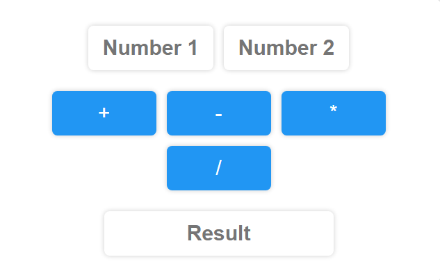

  

<h1 align="center" style="font-family: Arial, sans-serif; color: #007BFF;">Adams Shittu</h1>

  My most recent projects are placed at the top. 
  <em>Check out my 
    <strong><a href="#frontend" style="color: #007BFF; text-decoration: none;">frontend web development projects</a></strong> 
    and 
    <strong><a href="#analytics" style="color: #007BFF; text-decoration: none;">data analysis projects</a></strong>.
  </em>

<h2 align="center" style="font-family: Arial, sans-serif; background-color: #f0f0f0; padding: 10px; border-radius: 5px; color: #007BFF;">
  Backend Web Development Projects
</h2>
<ol style="font-family: Arial, sans-serif; color: #333; line-height: 1.6;">

  <li>
    <h3 style="color: #333;">Blog Project</h3>
    
Technologies Used: <strong>Python, Django, HTML, CSS, Bootstrap, SQLite</strong>

    

      Check out the  
      <strong><a target="_blank" href="https://github.com/shittuadams/my-first-blog" style="color: #007BFF; text-decoration: none;">code</a></strong> 
       and the 
      <strong><a target="_blank" href="https://shittu.pythonanywhere.com/" style="color: #007BFF; text-decoration: none;">live demo</a></strong>
       of the project.
    

    

      
    

  </li>
  
</ol>

<h2 id="frontend" align="center" style="font-family: Arial, sans-serif; background-color: #f0f0f0; padding: 10px; border-radius: 5px; color: #007BFF;">
  Frontend Web Development Projects
</h2>
<ol style="font-family: Arial, sans-serif; color: #333; line-height: 1.6;">

  <li>
    <h3 style="color: #333;">Simple Calculator Project</h3>
    
Technologies Used: <strong>HTML, CSS, JavaScript</strong>

    

      Check out the  
      <strong><a target="_blank" href="https://codepen.io/Shadams/pen/NWLBjGP" style="color: #007BFF; text-decoration: none;">code</a></strong> 
       and the 
      <strong><a target="_blank" href="https://codepen.io/Shadams/full/NWLBjGP" style="color: #007BFF; text-decoration: none;">live demo</a></strong> 
       of the project.
    

    

      
    

  </li>

  <!-- Repeat the same structure for other frontend projects -->

</ol>

<h2 id="analytics" align="center" style="font-family: Arial, sans-serif; background-color: #f0f0f0; padding: 10px; border-radius: 5px; color: #007BFF;">
  Data Analysis Projects
</h2>
<ol style="font-family: Arial, sans-serif; color: #333; line-height: 1.6;">

  <li>
    <h3 style="color: #333;">Airbnb Project</h3>
    
For more details on this project click <a target="_blank" href="https://github.com/shittuadams/AirBnB-Project" style="color: #007BFF; text-decoration: none;">here</a>.

    

      
    

  </li>

  <!-- Repeat the same structure for other data analysis projects -->

</ol>

  <a href="#top" style="padding: 10px 20px; background-color: #007BFF; color: white; text-decoration: none; border-radius: 5px;">
    Go to Top
  </a>

